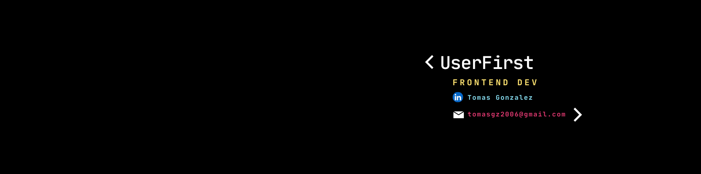

<h1 align="center">
  Hi, I'm Tomas Gonzalez 👋
</h1>

<h3 align="center">
  Software Developer @ dentsu · Frontend & Fullstack Development · Systems Engineering Student
</h3>

<p align="center">
  
</p>

<p align="center">
  <a href="https://www.linkedin.com/in/tomas-gonzalez-881966366/">
    
  </a>
  <a href="mailto:tomasgz2006@gmail.com">
    
  </a>
</p>

---

## 👨‍💻 About Me

I'm a **Software Developer currently working at dentsu**, focused on building modern, scalable and maintainable web applications.

My strongest area is frontend development with **React, Next.js and TypeScript**, but I'm actively developing a broader fullstack profile that includes backend development, databases, cloud infrastructure, testing, security and software architecture.

I enjoy understanding **why systems work**, not just making them work. I'm particularly interested in clean architecture, code quality, performance, developer experience and using AI-assisted development without sacrificing engineering fundamentals.

I'm also currently pursuing a **Systems Engineering degree**, continuing to strengthen my foundations in algorithms, architecture, databases, networking and software engineering.

---

## 🚀 What I'm Working On

* ⚛️ Building production applications with **React, Next.js and TypeScript**
* 🧩 Working with **headless CMS architectures using Contentful**
* 🔌 Integrating frontend applications with **REST and GraphQL APIs**
* ☁️ Expanding my knowledge of **AWS, cloud infrastructure and DevOps**
* 🧪 Improving my skills in **testing, code quality and software security**
* 🏗️ Learning more about **software architecture and scalable systems**
* 🤖 Exploring **AI-assisted and agentic software engineering workflows**
* 📚 Strengthening my foundations in **algorithms and problem solving**

---

## 🛠️ Tech Stack

### Frontend

<p>
  
</p>

### Backend & Data

<p>
  
</p>

### Cloud & Engineering

<p>
  
</p>

### Tools & Design

<p>
  
</p>

---

## 💼 Experience

### Software Developer — dentsu

Working on web platforms and digital experiences using modern frontend technologies and cloud-based architectures.

Some of the technologies and areas I work with include:

`Next.js` · `React` · `TypeScript` · `Contentful` · `GraphQL` · `AWS` · `REST APIs` · `SonarQube` · `Git`

### Frontend Developer — ABATECH

Worked on frontend applications with a focus on reusable React components, API integrations, accessibility, code quality and automated testing.

`React` · `JavaScript` · `REST APIs` · `Axios` · `CSS Modules` · `Playwright`

---

## 📊 GitHub Stats

<p align="center">
  
  
</p>

---

## 🧠 Current Focus

```text
Frontend        ████████████████████
Fullstack       ███████████████░░░░░
Architecture    ██████████░░░░░░░░░░
Cloud / DevOps  █████████░░░░░░░░░░░
AI Engineering  █████████░░░░░░░░░░░
```

My long-term goal is to become a well-rounded software engineer capable of designing, building and operating complete software systems — from the user interface to architecture and cloud infrastructure.

---

## 🤝 Let's Connect

I'm always interested in talking about software development, architecture, frontend engineering, cloud technologies and interesting projects.

<p align="center">
  <a href="https://www.linkedin.com/in/tomas-gonzalez-881966366/">
    
  </a>
  &nbsp;&nbsp;
  <a href="mailto:tomasgz2006@gmail.com">
    
  </a>
</p>

<p align="center">
  <i>Build things. Understand them. Improve them.</i>
</p>
