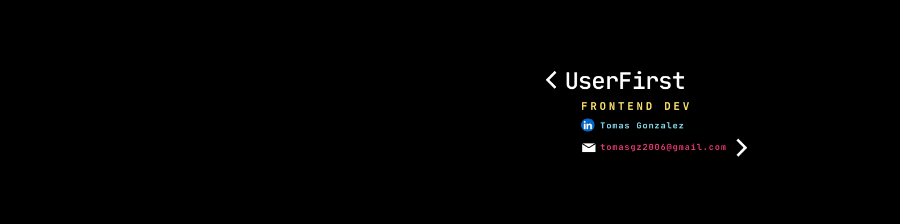

<h1 align="center">
  Hi There, I'm Tomas 
</h1>

  

<h3 align="center">
  👨‍💻 Software Developer | 🧠 Fullstack Enthusiast | 🎨 Frontend Focus | 📱 Responsive Web Design | 🧩 UI/UX
</h3>

 

  <em>
    Hey there! I'm Tomas, nice to meet you 😊  
    I'm passionate about clean code, good practices, and solving real-world problems. I have a 3-year degree in software development and I'm currently pursuing a professional career in systems engineering. Focused on fullstack development, I especially enjoy crafting polished, accessible, and responsive frontends. 💻  
    I have 6 months of experience in the software industry and I'm currently open to opportunities as a Frontend Developer.
  </em>

  

<h2 align="center">📊 Github Stats</h2>
 

  
  

 
<h2 align="center">🛠️ Technologies I work with</h2>
 

  

 
<h2 align="center">📬 Connect with me</h2>
 

   &nbsp;
  

